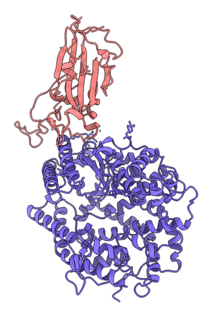
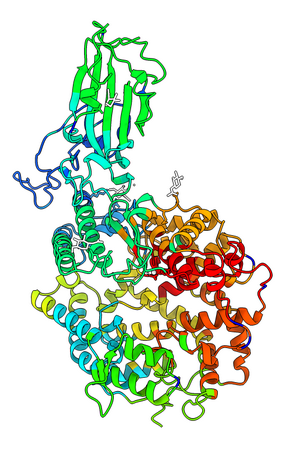

# 3Dnet

A tool to extract network communities from the network of contacts of protein 3D structures using the Louvain method. 

## Quick install

Open a terminal and enter the following:

``` bash
git clone https://github.com/vicruiser/3dnet.git
cd 3dnet
pip install . 
```

## Example

``` bash
3dnet -pdbcode '6lzg' -o results -f -pdbcomm -g
```

## Output

### Communities file 
File containing for each residue of the structure belonging to a community, the corresponding node in the network, the membership ID, the protein chain in the PDB and the residue ID. 

``` bash
node	membership	chain	resno	resid
0	1	A	19	SER
1	2	A	20	THR
10	2	A	29	LEU
100	3	A	119	ILE
1000	4	B	468	ILE
1001	1	B	469	SER
1002	1	B	470	THR
... ... ... ... ...
```

### Edges file
File containing edges that are established by the nodes of the communities. 
``` bash
0 11
0 12
0 170
0 390
0 500
1 279
1 390
1 500
2 94
```

### PDB file with communities (optional)
A PDB file is produced in which the B-factor column is replaced by the community number of each residue. Softwares such as Chimera or PyMol can be used to visualize the mapping of the communities to the protein 3D structure (see figure below).  

``` bash
ATOM      1  N   SER A  19     -31.664  51.480   2.788  1.00  1.00           N  
ATOM      2  CA  SER A  19     -31.092  50.291   2.166  1.00  1.00           C  
ATOM      3  C   SER A  19     -30.934  50.480   0.663  1.00  1.00           C  
ATOM      4  O   SER A  19     -31.884  50.855  -0.029  1.00  1.00           O  
ATOM      5  CB  SER A  19     -31.966  49.054   2.452  1.00  1.00           C  
ATOM      6  OG  SER A  19     -33.201  49.104   1.764  1.00  1.00           O  
ATOM      7  N   THR A  20     -29.733  50.213   0.160  1.00  2.00           N  
ATOM      8  CA  THR A  20     -29.449  50.371  -1.258  1.00  2.00           C  
ATOM      9  C   THR A  20     -30.198  49.319  -2.075  1.00  2.00           C  
ATOM     10  O   THR A  20     -30.827  48.401  -1.542  1.00  2.00           O  
ATOM     11  CB  THR A  20     -27.947  50.270  -1.527  1.00  2.00           C  
ATOM     12  OG1 THR A  20     -27.522  48.907  -1.382  1.00  2.00           O  
ATOM     13  CG2 THR A  20     -27.168  51.153  -0.561  1.00  2.00           C  
ATOM     14  N   ILE A  21     -30.118  49.461  -3.398  1.00  2.00           N  
ATOM     15  CA  ILE A  21     -30.806  48.516  -4.268  1.00  2.00           C  
ATOM     16  C   ILE A  21     -30.120  47.154  -4.225  1.00  2.00           C  
ATOM     17  O   ILE A  21     -30.782  46.113  -4.317  1.00  2.00           O 
```

PDB 6LZG colored by chain (left) and by communities (right).




